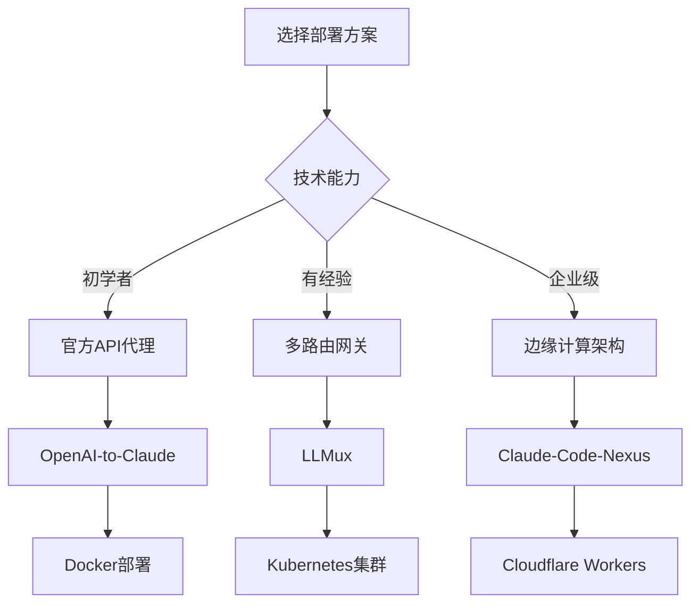

# 2API - 大模型2API应用教程与实战指南


[](https://github.com/keenturbo/2API/stargazers)
[](https://github.com/keenturbo/2API/network)
[](LICENSE)
[](https://github.com/keenturbo/2API/commits/main)

**一站式大模型2API解决方案 - Claude、GPT、Gemini等模型转OpenAI兼容API的完整实施方案**

[📖 查看教程](docs/) | [🚀 快速开始](#-快速开始) | [💬 交流社区](https://github.com/keenturbo/2API/discussions) | [🐛 问题反馈](https://github.com/keenturbo/2API/issues)


---

## 📋 项目简介

**2API** 是一个专门收集和整理各种大模型转换为OpenAI兼容API的教程和方案库。我们为零基础用户提供了从只有账号到成功部署的完整实现步骤，让您轻松使用Chatbox、Kelivo等手机APP连接各种AI模型。

### 🎯 核心目标

- **零基础友好**：详细的步骤说明，小白也能轻松上手
- **实用性强**：经过实战验证的部署方案
- **持续更新**：跟踪最新的技术发展和安全合规要求
- **社区驱动**：欢迎贡献新的方案和经验分享

### 📊 覆盖的模型和服务

| 模型类型 | 支持状态 | 难度等级 | 推荐方案 |
|---|---|---|---|
| **Claude** | ✅ 完全支持 | ⭐⭐ | OpenAI-to-Claude |
| **ChatGPT** | ✅ 完全支持 | ⭐⭐ | OneAPI网关 |
| **Gemini** | ✅ 完全支持 | ⭐⭐⭐ | Gemini2API |
| **文心一言** | 🚧 开发中 | ⭐⭐⭐⭐ | 逆向工程方案 |
| **通义千问** | 🚧 开发中 | ⭐⭐⭐ | 官方API代理 |
| **Kimi** | ✅ 完全支持 | ⭐⭐ | Moonshot API |

---

## 🚀 快速开始

### 1️⃣ 选择方案

根据您的需求和技术水平选择合适的方案：


| 场景 | 推荐方案 | 部署时间 | 成本 | 稳定性 |
|---|---|---|---|---|
| 🎓 **个人学习** | [OpenAI-to-Claude](docs/claude2api-analysis-report.md) | 10分钟 | 低 | ⭐⭐⭐⭐⭐ |
| 👥 **小团队使用** | [OneAPI多路由](docs/oneapi-tutorial.md) | 20分钟 | 中 | ⭐⭐⭐⭐ |
| 🏢 **企业级部署** | [Claude-Code-Nexus](docs/nexus-enterprise.md) | 30分钟 | 高 | ⭐⭐⭐⭐⭐ |
| 🔧 **技术探索** | [Claude-API逆向](docs/claude-reverse-api.md) | 40分钟 | 低 | ⭐⭐ |

### 2️⃣ 环境准备

**必需环境：**
- Python 3.11+ 或 Docker环境
- 云服务器或本地开发环境
- 对应AI服务的账号权限

**一键安装Docker（推荐）：**


```bash
curl -sSL https://get.docker.com/ | sh
systemctl start docker
systemctl enable docker
```

---

### 3️⃣ 部署教程

#### 🎯 最简单的Claude2API方案


##### 1. 克隆项目
```bash
git clone https://github.com/hsingjui/openai-to-claude.git
cd openai-to-claude
```
##### 2. 配置文件
```bash
cp config/example.json config/settings.json
```
编辑 config/settings.json 填入您的 API Key

##### 3. Docker一键部署
```
docker-compose up -d
```
##### 4. 验证服务
```
http://localhost:8000/health
```

**客户端配置：**
- Base URL: `http://your-server:8000/v1`
- API Key: 您设置的代理密钥
- Model: `claude-3-5-sonnet-20241022`


---

## 📚 教程文档

### 🔥 热门教程

| 教程名称 | 难度 | 阅读时间 | 更新日期 |
|---|---|---|---|
| [🎯 Claude2API完整实战教程](docs/claude2api-analysis-report.md) | ⭐⭐ | 15分钟 | 2025-12-02 |
| [🚀 OneAPI多模型网关部署](docs/oneapi-tutorial.md) | ⭐⭐⭐ | 20分钟 | 持续更新 |
| [⚡ Gemini2API快速部署](docs/gemini2api-tutorial.md) | ⭐⭐ | 10分钟 | 持续更新 |
| [🔧 自建2API高可用架构](docs/high-availability.md) | ⭐⭐⭐⭐ | 30分钟 | 持续更新 |

### 📖 进阶内容

- **[安全加固指南](docs/security-guide.md)** - API密钥保护、防火墙配置
- **[性能优化手册](docs/performance-optimization.md)** - 缓存策略、负载均衡
- **[监控运维体系](docs/monitoring.md)** - 日志收集、告警设置
- **[成本控制方案](docs/cost-control.md)** - 费用分析、预算管理

---

## 🛠️ 客户端支持

### 📱 移动端APP

| 应用名称 | 支持平台 | 配置难度 | 评分 |
|---|---|---|---|
| **Chatbox** | iOS/Android/Mac/Win | ⭐⭐ | ⭐⭐⭐⭐⭐ |
| **Kelivo** | iOS | ⭐⭐ | ⭐⭐⭐⭐ |
| **Open Chat** | Android | ⭐⭐ | ⭐⭐⭐ |
| **AI Girl** | Android | ⭐⭐⭐ | ⭐⭐⭐ |

### 💻 桌面端工具

| 工具名称 | 支持平台 | 特殊功能 |
|---|---|---|
| **Chatbox** | 全平台 | 多模型支持、本地存储 |
| **Claude Desktop** | Mac/Win | 官方客户端、插件系统 |
| **Cursor** | 全平台 | 编程专用、AI辅助 |
| **VS Code插件** | VS Code | 集成开发、代码生成 |

---

## 🏗️ 部署方案对比

### 📊 技术路线对比





### 💰 成本分析

| 方案 | 月成本 | API费用 | 维护成本 | 适合场景 |
|---|---|---|---|---|
| **官方API代理** | $5-15 | 按量计费 | 低 | 个人/小团队 |
| **多路由网关** | $20-50 | 按量计费 | 中 | 中小企业 |
| **边缘计算** | $30-100 | 按量计费 | 低 | 大型应用 |
| **自托管集群** | $100+ | 按量计费 | 高 | 大型企业 |

---

## 🚨 安全与合规

### ⚖️ 合规要求

- ✅ **使用官方API** - 避免TOS违规风险
- ✅ **数据加密传输** - HTTPS/TLS加密
- ✅ **访问权限控制** - API密钥管理
- ✅ **审计日志记录** - 完整的操作记录

### 🛡️ 安全最佳实践

1. **API密钥保护**
   - 定期轮换密钥
   - 使用环境变量存储
   - 不要硬编码在代码中

2. **网络安全**
   - 配置防火墙规则
   - 使用反向代理
   - 启用DDoS防护

3. **数据隐私**
   - 不保存敏感数据
   - 实施数据脱敏
   - 遵守GDPR/CCPA要求

---

## 📈 最新动态

### 🔥 近期更新

- **2025-12-02**: 发布 Claude2API 完整实战教程
- **2025-11-28**: 更新安全合规指南
- **2025-11-20**: 添加性能优化章节
- **2025-11-15**: 新增成本分析模块

### 📅 计划中功能

- [ ] **GPT-4o API代理教程** - 支持最新GPT模型
- [ ] **国产大模型集成** - 文心、通义、讯飞等
- [ ] **一键部署脚本** - 自动化配置工具
- [ ] **Web管理界面** - 可视化配置管理

---

## 🤝 社区贡献

我们欢迎各种形式的贡献！

### 📝 贡献方式

- 🐛 **提交Issue** - 报告问题或提出建议
- 📖 **改进文档** - 完善教程内容
- 🚀 **新方案** - 分享您的部署经验
- 🌟 **推广项目** - 帮助更多人发现我们


---

## 📞 支持与联系

### 💬 获取帮助

- **[GitHub Discussions](https://github.com/keenturbo/2API/discussions)** - 技术交流
- **[GitHub Issues](https://github.com/keenturbo/2API/issues)** - 问题反馈
- **[邮箱支持](mailto:support@2api.dev)** - 商务合作

### 🔗 相关链接

- **[ Claude官方网站 ](https://claude.ai/)**
- **[ Anthropic API文档 ](https://docs.anthropic.com/)**
- **[ OpenAI API文档 ](https://platform.openai.com/docs)**
- **[ FastAPI框架 ](https://fastapi.tiangolo.com/)**

---

## ⭐ Star History

[](https://star-history.com/#keenturbo/2API&Date)

---


### 🙏 致谢

感谢所有开源项目的贡献者们，正是你们的努力让AI技术变得更加开放和可及！

**如果这个项目对您有帮助，请给我们一个 ⭐ Star！**

---


**© 2025 2API技术团队 | 让每个人都能轻松使用AI服务**


---
